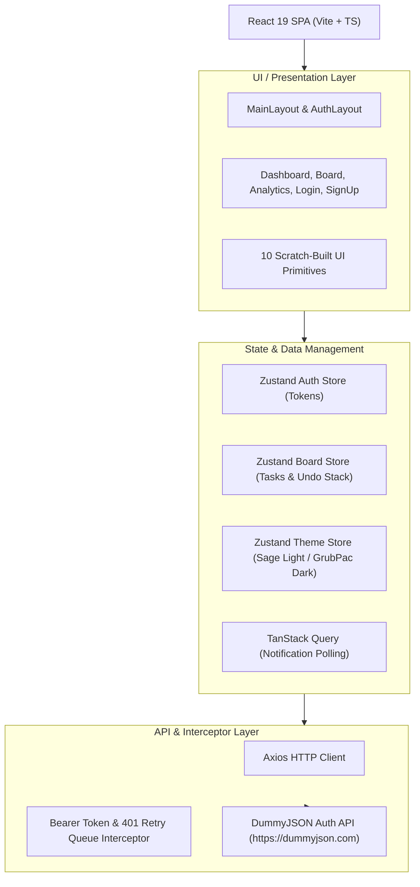

# 📄 SprintDesk — Official Assignment Submission Document

This document provides the complete submission package for **SprintDesk** in accordance with the required assignment guidelines (Sections 8.1 – 8.7).

---

## 📌 Master Submission Links (Section 8.7)

| Resource | Link |
|---|---|
| **Public GitHub Repository** | [https://github.com/KavishRazdan/SprintDesk](https://github.com/KavishRazdan/SprintDesk) |
| **Live Deployed Web Application** | [https://sprintdesk-kavish.netlify.app](https://sprintdesk-kavish.netlify.app) |
| **Local Dev URL** | `http://localhost:3000` |
| **Architecture Document** | Included below in Section 8.2 |
| **API Documentation** | Included below in Section 8.3 |
| **Demo Script & Video Outline** | Included below in Section 8.4 |

---

## 8.1. GitHub Repository

- **Repository Link**: [https://github.com/KavishRazdan/SprintDesk](https://github.com/KavishRazdan/SprintDesk)
- **Codebase Quality**: Built with **React 19**, **TypeScript (strict mode)**, **Vite**, **Tailwind CSS v3+**, **Zustand v5**, **TanStack Query v5**, **@dnd-kit/core**, **Recharts**, and **Vitest**.
- **Scratch-Built UI Primitives**: 100% custom primitives without third-party component libraries (`Button`, `Input`, `Select`, `Modal`, `Toast`, `DataTable`, `Skeleton`, `TaskCard`, `KanbanColumn`, `NotificationBell`, `SprintDeskLogo`).

---


## 8.2. Architecture Document

### System Architecture Overview



### Data Flow Breakdown

1. **Authentication Data Flow**:
   - User inputs credentials on `/login` or `/signup`.
   - `useAuth` calls `auth.api.ts` -> `POST https://dummyjson.com/auth/login`.
   - On success, `accessToken` is stored in memory and `refreshToken` is saved in `localStorage`.
   - `Axios` request interceptor attaches `Authorization: Bearer <token>` to all requests.
   - If an API returns `401 Unauthorized`, response interceptor queues failed requests, invokes `POST /auth/refresh`, updates `accessToken`, and retries queued requests automatically.

2. **Kanban Drag-and-Drop & Action History Data Flow**:
   - User drags a `TaskCard` across columns using `@dnd-kit/core`.
   - `board.store.ts` captures previous state into an in-memory `history` array before mutating task status.
   - User clicks **Undo** button -> `undoLastAction()` pops the last state snapshot from history and restores board state instantly.
   - Board state persists across browser reloads via Zustand `persist` middleware.

3. **Real-Time Notification Polling Flow**:
   - `useNotifications` hook executes polling requests using TanStack Query.
   - Refetches notification state every 15 seconds without causing UI layout shifts.
   - Updates unread badge counter and renders portaled notification drawer (`NotificationBell.tsx`).

---

## 8.3. API Documentation

SprintDesk integrates with the **DummyJSON Authentication API**. Below are the endpoint schemas and request/response specifications.

### 1. User Login (`POST /auth/login`)
- **Endpoint**: `https://dummyjson.com/auth/login`
- **Headers**: `Content-Type: application/json`
- **Request Body**:
```json
{
  "username": "emilys",
  "password": "emilyspass",
  "expiresInMins": 30
}
```
- **Response `200 OK`**:
```json
{
  "id": 1,
  "username": "emilys",
  "email": "emily.johnson@x.dummyjson.com",
  "firstName": "Emily",
  "lastName": "Johnson",
  "gender": "female",
  "image": "https://dummyjson.com/icon/emilys/128",
  "accessToken": "eyJhbGciOiJIUzI1NiIsInR5cCI6IkpXVCJ9...",
  "refreshToken": "eyJhbGciOiJIUzI1NiIsInR5cCI6IkpXVCJ9..."
}
```

### 2. Refresh Auth Token (`POST /auth/refresh`)
- **Endpoint**: `https://dummyjson.com/auth/refresh`
- **Headers**: `Content-Type: application/json`
- **Request Body**:
```json
{
  "refreshToken": "eyJhbGciOiJIUzI1NiIsInR5cCI6IkpXVCJ9...",
  "expiresInMins": 30
}
```
- **Response `200 OK`**:
```json
{
  "accessToken": "eyJhbGciOiJIUzI1NiIsInR5cCI6IkpXVCJ9...",
  "refreshToken": "eyJhbGciOiJIUzI1NiIsInR5cCI6IkpXVCJ9..."
}
```

### 3. Get Current User Session (`GET /auth/me`)
- **Endpoint**: `https://dummyjson.com/auth/me`
- **Headers**: `Authorization: Bearer <accessToken>`
- **Response `200 OK`**: Returns user profile payload.

---

## 8.4. Screen Recording & Demo Guide

When recording the project demo video, follow this recommended walkthrough sequence:

1. **Authentication Flow** *(0:00 - 0:45)*:
   - Navigate to `/login`. Demonstrate email/password inputs, show/hide password toggle, and auto-fill demo button.
   - Switch to `/signup` and showcase the Sage Green & Warm Beige aesthetic without redundant subtitle text.
   - Log in using `emilys` / `emilyspass`.

2. **Sprint Control Center Dashboard** *(0:45 - 1:30)*:
   - Highlight top bar with custom geometric `SprintDeskLogo.tsx`.
   - Toggle Sun/Moon icon to demonstrate Light Mode (Sage Green & Warm Beige) vs Dark Mode (GrubPac dark technology).
   - View recent task activity and team member stats.

3. **Kanban Drag-and-Drop Workspace** *(1:30 - 2:45)*:
   - Drag task cards across Backlog, In Progress, Review, and Done columns.
   - Click **Undo** to demonstrate state rollback.
   - Open a task card to view the portaled side drawer (`z-[9999]`). Edit task title/priority and submit.
   - Filter tasks by priority or search query.

4. **Real-Time Notifications & Analytics** *(2:45 - 3:30)*:
   - Click the Notification Bell to open the portaled notification drawer. Mark notifications as read.
   - Navigate to `/analytics` and demonstrate the 4 Recharts graphs (Sprint Velocity, Task Status Distribution, Priority Breakdown, Completion Trend).

---

## 8.5. Setup Instructions

### Prerequisites
- Node.js **>= 18.0.0**
- npm **>= 9.0.0**

### Step 1: Clone Repository & Install Dependencies
```bash
git clone https://github.com/KavishRazdan/SprintDesk.git
cd SprintDesk
npm install
```

### Step 2: Configure Environment Variables
Copy `.env.example` to `.env.local`:
```bash
cp .env.example .env.local
```
Content of `.env.local`:
```env
VITE_API_BASE_URL=https://dummyjson.com
VITE_POLLING_INTERVAL_MS=15000
```

### Step 3: Run Development Server
```bash
npm run dev
```
Open [http://localhost:3000](http://localhost:3000).

### Step 4: Execute Test Suite
```bash
npm test
```

### Step 5: Build Production Bundle
```bash
npm run build
```

---

## 8.6. Security Compliance

- 🔒 **Zero Hardcoded Secrets**: No passwords, private keys, or API tokens are hardcoded or committed to git.
- 🔒 **In-Memory Access Tokens**: Short-lived access tokens are stored strictly in-memory within Zustand auth store state.
- 🔒 **Silent Token Refresh**: Failed 401 requests trigger token refresh requests without exposing credentials.
- 🔒 **Git Ignore Rules**: `.gitignore` excludes `.env`, `.env.local`, `node_modules`, `dist`, and build logs.

---

## 8.7. Final Submission Checklist

- [x] Public GitHub Repository: [https://github.com/KavishRazdan/SprintDesk](https://github.com/KavishRazdan/SprintDesk)
- [x] Deployed Live Demo: [https://sprintdesk-kavish.netlify.app](https://sprintdesk-kavish.netlify.app)
- [x] System Architecture Document & Mermaid Diagram
- [x] API Documentation & Request/Response Endpoints
- [x] Demo Script & Walkthrough Outline
- [x] Local Setup Instructions & Environment Variables
- [x] Security Practices & Sensitive Credential Protection
